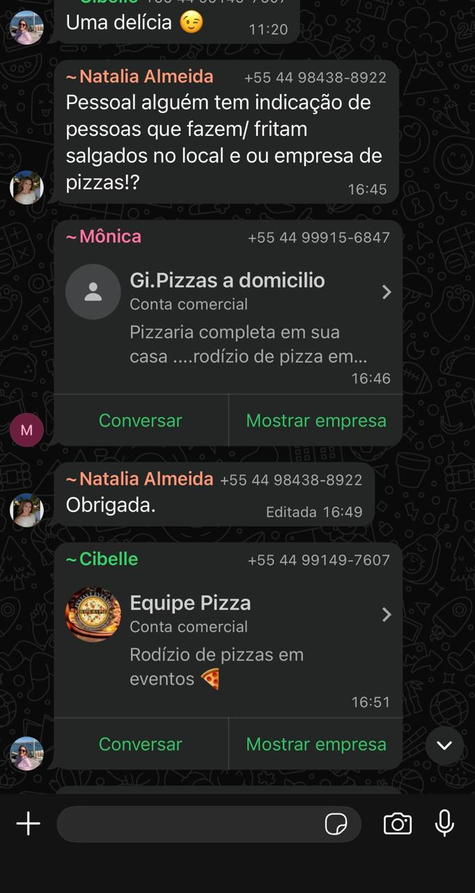
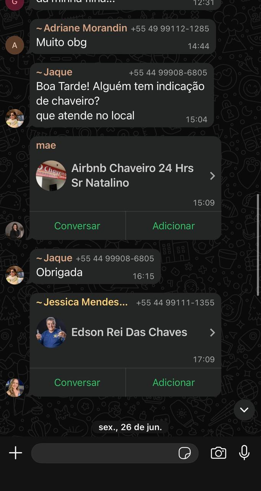
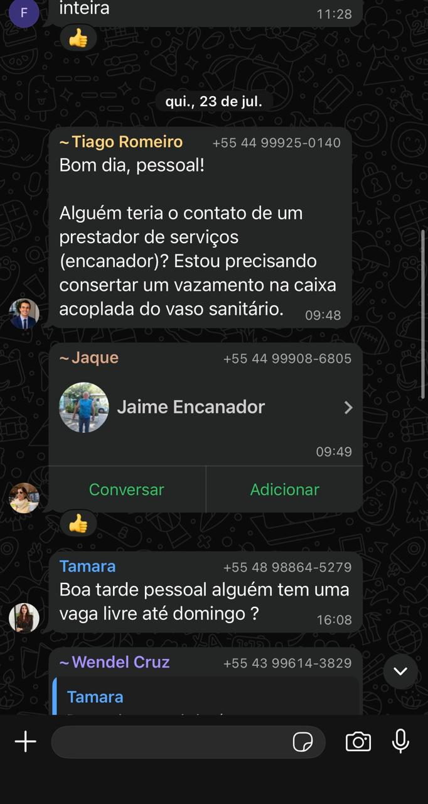

## Problema identificado

Atualmente, quando um morador precisa realizar algum reparo ou manutenção em seu apartamento, é comum recorrer aos grupos de WhatsApp do condomínio para pedir indicações de profissionais.

Mensagens como **“Alguém conhece um eletricista?”**, **“Alguém tem contato de quem conserta máquina de lavar?”** ou **“Alguém indica um encanador?”** são frequentes nesses grupos.

Alguns exemplos reais desse comportamento podem ser observados nos grupos do próprio condomínio:

  
  

  
  

Apesar de funcionar, esse processo é pouco organizado. As indicações ficam espalhadas entre diversas mensagens, dificultando encontrar novamente um profissional recomendado anteriormente. Além disso, normalmente não há informações suficientes sobre a qualidade do serviço, preço cobrado ou confiabilidade do profissional.

## Nossa solução

Para solucionar esse problema, o aplicativo conta com uma aba exclusiva de **Serviços**, voltada para as necessidades dos moradores dentro de seus apartamentos.

Ao precisar de algum serviço, o morador poderá selecionar o que necessita, como manutenção de máquina de lavar, serviços elétricos, hidráulicos, pintura, instalação de equipamentos, entre outros.

O aplicativo apresentará profissionais que foram **indicados e utilizados pelos próprios moradores do condomínio**, permitindo que o usuário tenha acesso ao contato do prestador, como seu WhatsApp, e às avaliações deixadas por outros moradores.

Além da avaliação por estrelas, os usuários poderão compartilhar suas experiências por meio de comentários, informando aspectos como qualidade do serviço, confiabilidade e preço. Por exemplo:

> **Rodrigo — ⭐⭐⭐⭐⭐**
> “Profissional confiável, realizou o serviço corretamente e cobrou R$ 100.”

## Diferencial

O principal diferencial é transformar as indicações que hoje acontecem de maneira informal nos grupos de WhatsApp em uma **rede organizada de profissionais recomendados pela própria comunidade do condomínio**.

Dessa forma, o morador não precisa depender de mensagens antigas ou contratar um profissional completamente desconhecido. Ele pode consultar as experiências de outros moradores antes de entrar em contato.

Ao mesmo tempo, bons profissionais podem construir uma reputação dentro da plataforma por meio das avaliações dos moradores, criando um sistema baseado em **confiança, experiência e recomendação da própria comunidade**.
